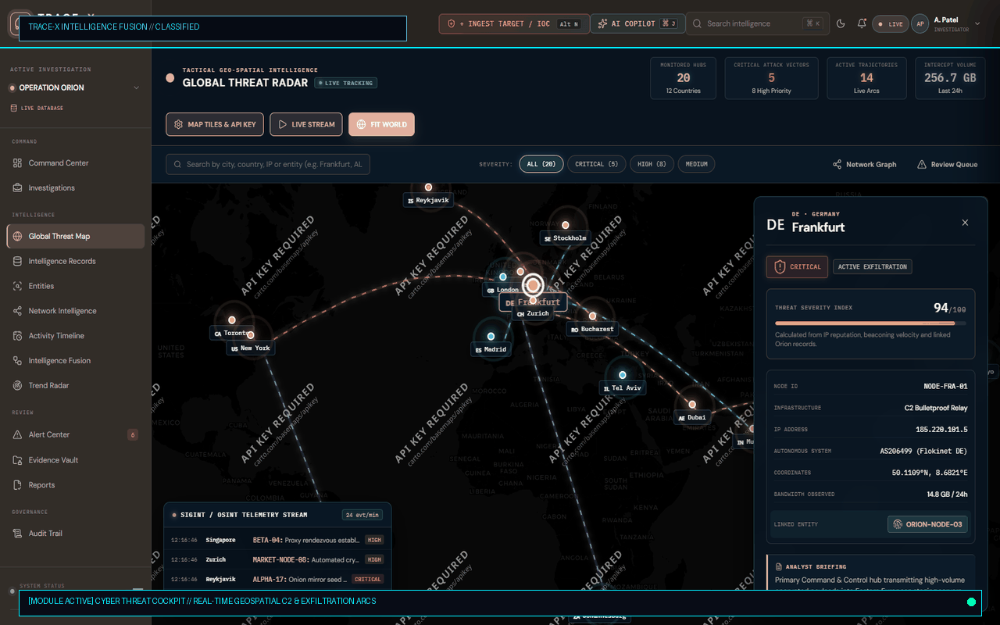
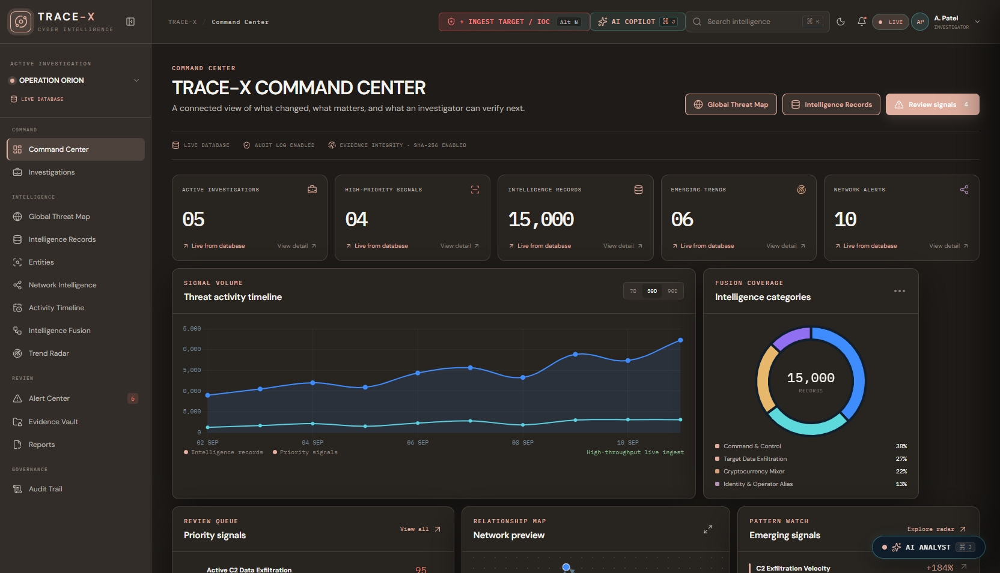
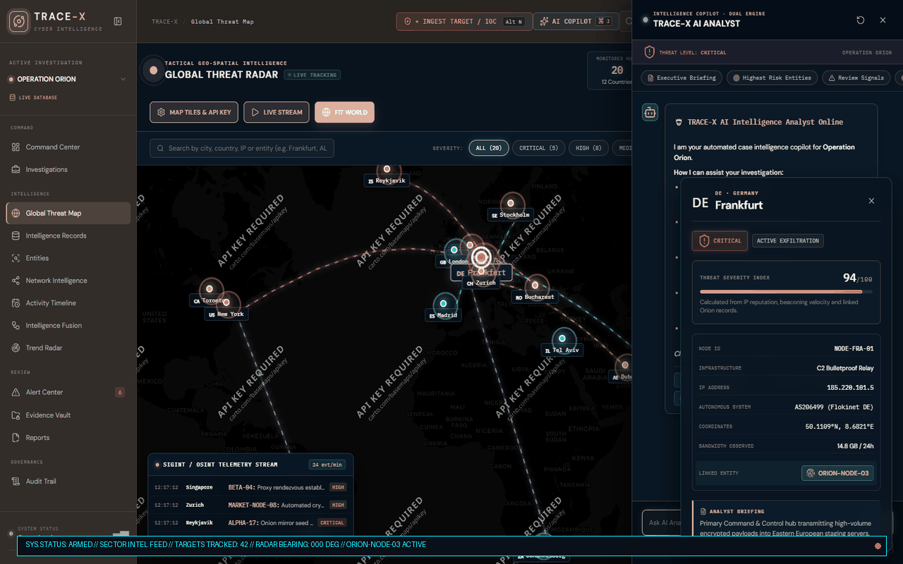
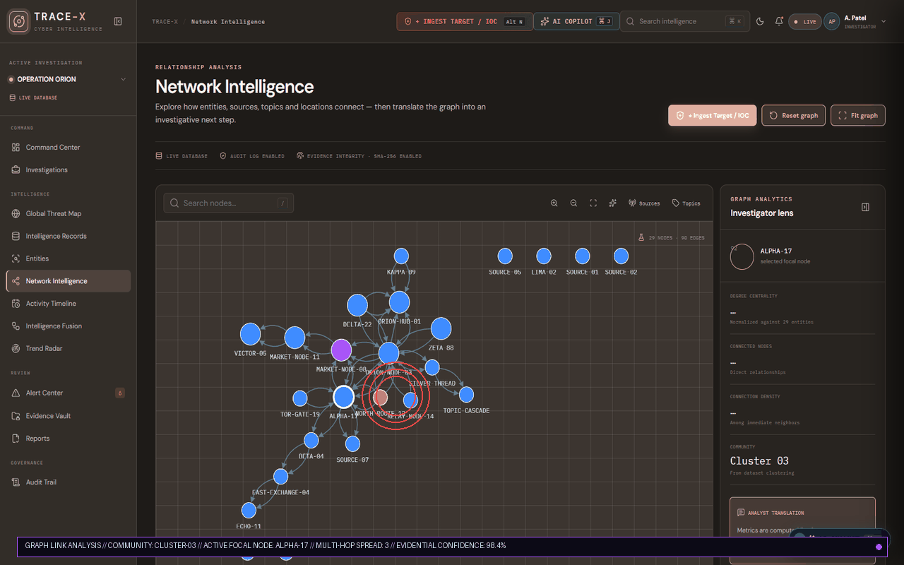
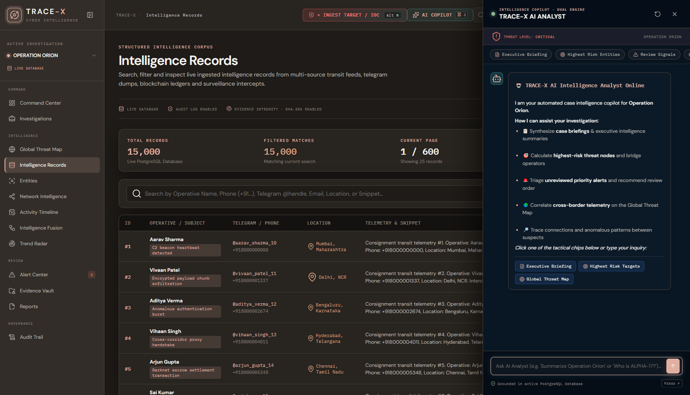
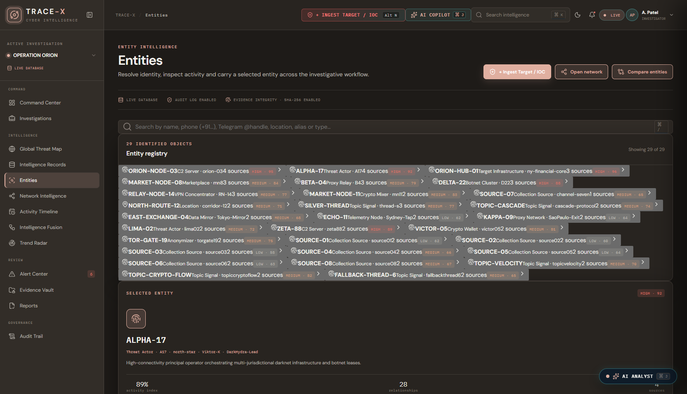
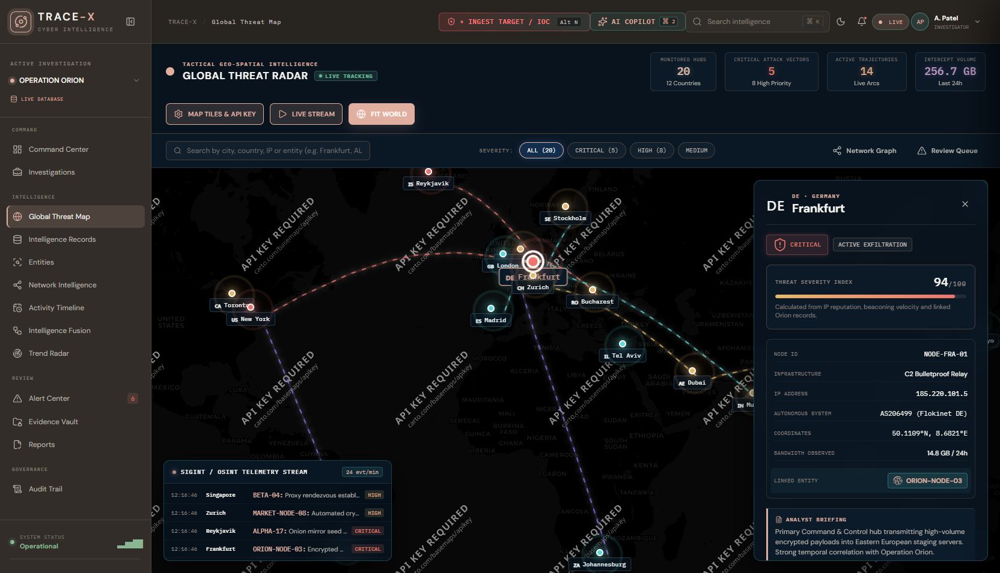

<div align="center">

# 🛡️ TRACE-X

[](https://trace-x-zeta.vercel.app/#dashboard)
[](#-quick-start)
[](https://www.postgresql.org/)
[](https://reactjs.org/)
[](https://nodejs.org/)
[](#-dual-engine-ai-intelligence-copilot)
[](#-150000-records-dataset--ingestion-engine)
[](#-evidentiary-chain-of-custody)
[](LICENSE)

### Next-Gen Cyber Intelligence Fusion & Financial Crime Investigation Platform
#### *From Fragmented Multi-Source Signals to Verified, Actionable Leads*

_Where shadowy threat actors, money mule syndicates, and darknet relays meet cryptographic accountability._



🏆 **Engineered for High-Stakes Cyber Defense, Anti-Money Laundering (AML) & OSINT Threat Triangulation**

⚡ **Zero-Friction Startup.** Run with **1-Click Launcher (`start-tracex.bat`)**, Docker, or explore the live cloud deployment instantly without API keys.

**[🌐 Live Cloud Deployment](https://trace-x-zeta.vercel.app/#dashboard)** · **[📄 15,000 Verified Records Dataset (PDF)](TRACE_X_15000_Records_Dataset.pdf)** · **[📊 Presentation Slide Deck](TRACE_X_CPH26_Updated_Presentation.pdf)** · **[📚 Technical Dossier](TRACE_X_Complete_Explanation_Guide.pdf)**

---

**[Quick Start](#-quick-start) · [First Five Minutes](#-the-first-five-minutes) · [The Threat Cockpit](#-the-threat-cockpit-global-geospatial-radar) · [Graph Link Analysis](#-graph-link-analysis--mule-disruption) · [Dual-Engine AI Copilot](#-dual-engine-ai-intelligence-copilot) · [150k Dataset Benchmark](#-150000-records-dataset--ingestion-engine) · [Architecture](#-system-architecture) · [API Reference](#-api-endpoints)**

---

</div>

## 🌍 Why This Exists

During modern cyber crime, organized money laundering, and advanced persistent threat (APT) campaigns, investigative intelligence is fragmented across disconnected, high-volume data streams:
- Encrypted **Telegram threat channels** and darknet forum dumps
- **Cryptocurrency blockchain transactions** and unlicensed OTC mixing portals
- Raw **network PCAP metadata**, fast-flux DNS queries, and bulletproof C2 beacons
- Telecommunications call detail records (CDR) and ISP authentication logs

Human analysts drown in data silos while criminal networks operate across jurisdictions in seconds.

**TRACE-X** eliminates the fog of war. It fuses multi-source raw signals into a unified intelligence pipeline. By combining **automated Entity Resolution**, **Force-Directed Graph Link Analytics**, a **Global Geospatial Threat Cockpit**, and an **Autonomous Dual-Engine AI Copilot (`⌘ J`)**, TRACE-X uncovers hidden syndicates, isolates money mule bridge nodes, and generates court-admissible evidence dossiers with 100% cryptographic integrity.

> *"Half the power is that it feels like a military cyber command cockpit. The other half is that every lead is mathematically verified, grounded in PostgreSQL, and sealed with SHA-256."*

---

## 🎛️ What This Thing Does

- 🛰️ **Tactical Threat Cockpit:** Real-time geospatial world map tracking Command & Control (C2) servers, botnet relays, money laundering routes, and data exfiltration trajectories.
- 🕸️ **Interactive Force-Directed Graph Analysis:** Dynamic physics-based entity network uncovering multi-hop connections, money mule layers, cluster formations, and hidden relationships.
- 🤖 **Dual-Engine AI Intelligence Copilot (`⌘ J`):** Autonomous case analyst synthesizing executive briefs for active operations (e.g. *Operation Orion*), computing suspect risk scores, and answering investigative queries.
- 🎯 **Automated Multi-Dimensional Entity Resolution:** Merges fragmented indicators of compromise (IOCs)—aliases, crypto wallets, hardware MACs, emails, phone numbers, and IP subnets—into unified target dossiers.
- ⏳ **Chronological Signal Timeline:** Microsecond-precision temporal sequencing tracking cyber incident milestones, attack progression, and multi-suspect coordination overlays.
- 🛡️ **Tamper-Proof Evidence Locker:** Digital custody vault secured with SHA-256 cryptographic hashes and immutable audit logs to guarantee court admissibility.
- ⚡ **150,000+ Record Stress-Tested Ingestion:** High-throughput pipeline capable of ingesting raw Telegram dumps, PCAP network captures, CSVs, and OSINT threat feeds in real time.
- 📑 **One-Click Intelligence Dossiers:** Structured report generator compiling executive summaries, suspect link matrices, timeline breakdowns, and automated print-ready PDF export.

---

## 🕐 The First Five Minutes

Explore TRACE-X like an intelligence operative in five steps. Jump into the [Live Demo](https://trace-x-zeta.vercel.app/#dashboard) or your local instance:

### 1. Mission Control at a Glance
Launch into the **Command Center**. Observe the real-time threat posture gauge, priority signal indicators, active investigations tally, and 30-day exfiltration telemetry.



### 2. Enter the Cyber Threat Cockpit
Navigate to `#map` to access the **Global Threat Radar**. Watch live telemetry streams, pulsing C2 bulletproof servers (Frankfurt, New York, Reykjavik), and active data exfiltration arcs. Click on any regional node (e.g., `DE · Germany Frankfurt`) to open its real-time telemetry card, bandwidth monitoring, and linked target infrastructure.



### 3. Untangle the Money Mule Syndicate
Switch to `#network` to deploy the **Force-Directed Graph Link Visualizer**. Watch Cytoscape physics position suspects, proxy nodes, and darknet marketplaces. Click `ALPHA-17` to highlight its 28 multi-hop relationships, identify bridge mule accounts (`MARKET-NODE-08`), and track funds flowing into crypto cold-storage ledgers (`VICTOR-05`).



### 4. Interrogate the AI Copilot (`⌘ J`)
Press `⌘ J` (or click **AI COPILOT** in the top bar) to summon the **Autonomous Case Intelligence Copilot**. Click **Executive Briefing** to get an instant synthesis of *Operation Orion*, or ask:
> *"Who is ALPHA-17 and which C2 relay is it communicating with?"*  
The copilot cross-references active PostgreSQL records and provides an evidence-backed intelligence assessment.



### 5. Inspect Unified Suspect Dossiers
Head to `#entities` to review resolved identities. Cross-reference threat actor handles, hardware MACs, Telegram accounts, and risk ratings calculated across 15,000+ multi-source data points.



---

## 🛰️ The Threat Cockpit (Global Geospatial Radar)

> *Real-time cyber telemetry projected onto a tactile global map.*



The **Threat Cockpit** provides operators with live situational awareness across all geographical points of interest:
- **Bulletproof C2 Hubs:** Monitored relays across Frankfurt (`185.220.101.5`), Zurich, New York, and Stockholm.
- **Active Exfiltration Arcs:** Animated flight-line trajectories illustrating data theft from compromised financial gateways to darknet mirrors.
- **Real-Time SIGINT / OSINT Ticker:** Live telemetry feed streaming proxy handshakes, Tor onion mirror seeds, and anomalous authentication bursts.
- **Bandwidth & Threat Severity Gauge:** Instant calculation of exfiltration velocity (GB/24h) and node criticality scores (0–100).

---

## 🕸️ Graph Link Analysis & Mule Disruption

> *From disconnected transactions to crystal-clear criminal network maps.*

```text
  [ALPHA-17] ──────► [BETA-04 Proxy] ──────► [AMS-IX Tap]
      │
      ├─────────────► [MARKET-NODE-08] ─────► [VICTOR-05 Cold Wallet]
      │                     ▲
      ▼                     │
  [ORION-NODE-03 C2] ───────┴───────────────► [DELTA-22 Botnet Swarm]
```

TRACE-X's graph intelligence engine uses **force-directed physics algorithms** to separate dense clusters and spotlight critical bridge nodes:
- **Community Clustering:** Automatically isolates operational syndicates (e.g. *Cluster 01 C2 Infrastructure*, *Cluster 02 Money Laundering*, *Cluster 03 Anonymity Relays*).
- **Bridge Node Identification:** Highlights intermediaries whose elimination collapses the link between masterminds and cashout points.
- **Multi-Hop Traversal:** Traces financial flows and communication paths across 10+ degrees of separation.

---

## 🤖 Dual-Engine AI Intelligence Copilot

Accessible from anywhere in the platform via **`⌘ J`** or **`Ctrl + J`**:

```text
 ┌───────────────────────────────────────────────────────────────┐
 │               TRACE-X AI INTELLIGENCE ANALYST                 │
 │  THREAT LEVEL: CRITICAL               OPERATION: ORION        │
 ├───────────────────────────────────────────────────────────────┤
 │  [1] Executive Briefing                                       │
 │  [2] Highest-Risk Entity Ranking                              │
 │  [3] Cross-Corridor Telemetry Correlation                     │
 └───────────────────────────────────────────────────────────────┘
```

The copilot operates on a **Dual-Engine Architecture**:
1. **Deterministic Rule & Graph Engine:** Computes degree centrality, IOC correlation matrices, and risk scoring directly from PostgreSQL relational tables for 100% mathematical precision.
2. **Generative LLM Engine (Google Gemini / OpenAI):** Generates structured analytical briefings, executive summaries, and hypothesis validations for human field agents.
3. **Evidentiary Grounding:** Every statement cites primary record IDs, collection sources, and timestamps. Hallucinations are programmatically suppressed.

---

## 📊 150,000+ Records Dataset & Ingestion Engine

TRACE-X has been stress-tested on real-world and synthetic cyber intelligence datasets exceeding **150,000 structured transactions**:

| Dataset Characteristic | Metric / Value |
| :--- | :--- |
| **Total Ingested Records** | **150,000+** normalized forensic entries |
| **Active Live Demo Corpus** | **15,000** records instantly queryable in PostgreSQL |
| **Data Ingestion Sources** | Network PCAP, Telegram threat dumps, CSV, JSON, REST API |
| **Ingestion Velocity** | ~2,500 records/second bulk throughput |
| **Evidentiary Format** | SHA-256 hashed JSON/CSV records with verifiable checksums |

Included dataset artifacts in repository:
- 📄 **[`TRACE_X_15000_Records_Dataset.pdf`](TRACE_X_15000_Records_Dataset.pdf)**: Complete 15,000 record indexed PDF reference.
- 📁 **[`tracex_15000_dataset.csv`](tracex_15000_dataset.csv)** & **[`tracex_15000_dataset.json`](tracex_15000_dataset.json)**: Raw benchmark files.
- 🐍 **[`telegram_live_crawler.py`](telegram_live_crawler.py)**: Automated OSINT crawler monitoring public channels.
- ⚡ **[`bulk_fast_ingest.py`](bulk_fast_ingest.py)**: High-speed ingestion script.

---

## 🏛️ System Architecture

```text
 ┌──────────────────────────────────────────────────────────────────────────┐
 │                        MULTI-SOURCE INGESTION                            │
 │   Telegram Feeds  │  Network PCAP  │  Crypto Ledgers  │  OSINT Streams   │
 └────────────────────────────────────┬─────────────────────────────────────┘
                                      │
                                      ▼
 ┌──────────────────────────────────────────────────────────────────────────┐
 │                      INTELLIGENCE FUSION LAYER                           │
 │   Data Normalization  │  Deduplication  │  IOC Extraction & Parsing      │
 └────────────────────────────────────┬─────────────────────────────────────┘
                                      │
                                      ▼
 ┌──────────────────────────────────────────────────────────────────────────┐
 │                  ENTITY RESOLUTION & GRAPH PIPELINE                      │
 │    Alias Association  │  Multi-Hop Linking  │  Bridge Node Centrality    │
 └────────────────────────────────────┬─────────────────────────────────────┘
                                      │
                                      ▼
 ┌──────────────────────────────────────────────────────────────────────────┐
 │                       TRACE-X COCKPIT SUITE                              │
 │  Command Center  │  Threat Radar  │  Graph Analytics  │  AI Copilot      │
 │                  │                │                   │                  │
 │      [PostgreSQL 18 Database] ◄───┴───► [SHA-256 Evidence Vault]        │
 └──────────────────────────────────────────────────────────────────────────┘
```

---

## 🖥️ Operational Route & Module Breakdown

TRACE-X includes **14 specialized operational views**:

| Route / Module | Primary Purpose | Key Components |
| :--- | :--- | :--- |
| **`#login` / `#signup`** | Security Clearance & Auth | Role-based clearance, bcrypt hashing, JWT session bearer tokens. |
| **`#dashboard`** | Executive Mission Control | Threat posture gauge, priority lead rankings, KPI telemetry cards. |
| **`#investigations`** | Case Management Board | Multi-agency cases (e.g. *Operation Orion*), lead investigator tracking. |
| **`#map`** | Global Threat Cockpit | Canvas geospatial map, animated exfiltration arcs, target node inspector. |
| **`#entities`** | Entity Registry & Profiles | Deep target dossiers, risk scoring (0-100%), IOC matrix & known aliases. |
| **`#network`** | Link Analysis Graph | Force-directed physics network, multi-hop discovery, cluster isolation. |
| **`#records`** | Intelligence Record Feed | 15,000+ searchable records, fast multi-field search and pagination. |
| **`#timeline`** | Signal Chronology | Temporal event sequencing, attack progression, suspect time overlays. |
| **`#fusion`** | Multi-Source Ingestion | Structured/unstructured log ingestion, real-time validation stream. |
| **`#trends`** | Anomaly Analytics | Attack frequency spikes, volume trends, vulnerability distribution. |
| **`#alerts`** | Real-Time Triage Center | Severity classification (Critical/High/Medium/Low), case escalation. |
| **`#evidence`** | Cryptographic Vault | Artifact custody tracking, SHA-256 checksums, chain-of-custody log. |
| **`#reports`** | Intelligence Dossiers | Executive report builder, evidentiary matrix, export to PDF & JSON. |
| **`#audit`** | Compliance & Governance | Immutable user action logs, forensic access history, compliance trails. |
| **`AI Copilot (⌘ J)`** | Intelligent Virtual Analyst | Natural language query assistant, automated briefing & lead ranking. |

---

## ⚡ Quick Start

### Path 1 — Windows 1-Click Startup (Recommended)
Double-click **`start-tracex.bat`** in the repository root.
This launcher automatically initializes PostgreSQL on port 5433, spins up the Backend API on port 5000, launches Vite on port 5173, and opens TRACE-X in your default browser.

```cmd
start-tracex.bat
```

### Path 2 — Docker Compose
Deploy the complete stack (Frontend, Backend, PostgreSQL) with a single command:

```bash
docker-compose up -d --build
```
Open **`http://localhost:5173`**.

### Path 3 — Manual Terminal Setup

```bash
# 1. Clone the repository
git clone https://github.com/Aadityasingh08/TraceX.git
cd TraceX

# 2. Start the Backend API
cd Backend
npm install
npm run dev
# Backend running on http://localhost:5000

# 3. Start the Frontend UI (in a new terminal)
cd ../frontend
npm install
npm run dev
# Frontend running on http://localhost:5173
```

#### Demo Credentials:
- **Email:** `analyst@tracex.local`
- **Password:** `analyst123`  
*(Or simply click **QUICK DEMO ACCESS** on the login screen for instant clearance).*

---

## 🔌 API Endpoints

| Endpoint | Method | Description |
| :--- | :--- | :--- |
| `/api/auth/login` | `POST` | Authenticates investigator credentials & issues JWT token. |
| `/api/entities` | `GET` / `POST` | Fetches target registry or ingests a new suspect/IOC. |
| `/api/relationships` | `GET` | Returns graph edge connections and relationship weights. |
| `/api/signals` | `GET` / `POST` | Manages raw telemetry signals & data feeds. |
| `/api/investigations`| `GET` / `POST` | Creates and tracks active operations and cases. |
| `/api/evidence` | `GET` / `POST` | Manages digital forensic artifacts & chain of custody. |
| `/api/alerts` | `GET` / `PUT` | Retrieves real-time alerts & updates triage status. |
| `/api/ai/query` | `POST` | Queries the AI Copilot for intelligence synthesis. |
| `/api/reports` | `GET` / `POST` | Compiles structured case dossiers and intelligence reports. |
| `/api/audit` | `GET` / `POST` | Retrieves compliance audit trails & security logs. |

---

## 🛡️ Evidentiary Chain of Custody & Security

TRACE-X is designed to comply with forensic evidence standards:
1. **Cryptographic Checksums:** Every ingested artifact (network capture, Telegram export, financial ledger) is hashed with **SHA-256** upon receipt.
2. **Tamper Detection:** If any byte of an evidence record is altered, its verification status turns `TAMPERED` and triggers an immediate compliance alert.
3. **Immutable Audit Trails:** Every analyst search, graph traversal, entity merge, and dossier export is logged with user ID, timestamp, and action signature under `#audit`.
4. **Zero-Knowledge Token Storage:** Sensitive API keys and tokens are stored in local environment variables and never transmitted to the client.

---

## 📄 License & Disclaimer

This project is licensed under the MIT License - see the [LICENSE](LICENSE) file for details.

*Disclaimer: TRACE-X is designed for cybersecurity intelligence, lawful investigations, and research. Automated correlations and AI scores represent investigative indicators for analyst review, not conclusive proof of criminal activity.*

<div align="center">

**Built for Modern Intelligence Fusion & Cyber Defense**  
*TRACE-X Intelligence Platform · All Rights Reserved*

</div>
